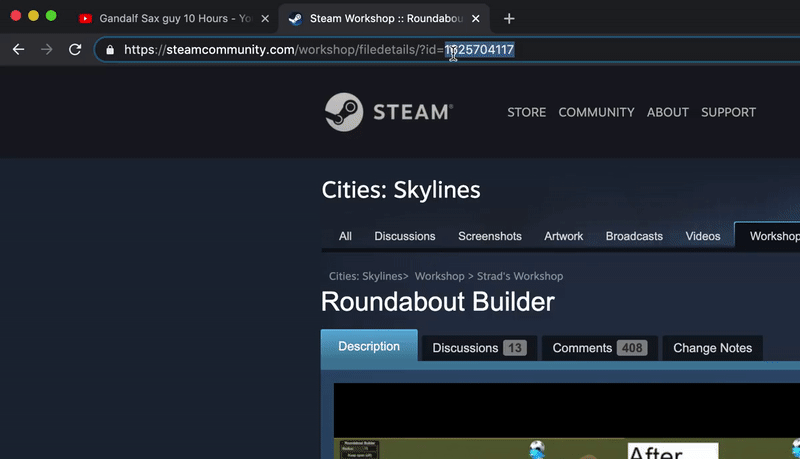

# CSMM-CLI

A simple CLI based mod manager for Cities: Skylines.

[](https://oclif.io)
[](https://npmjs.com/package/csmm-cli)
[](https://www.npmjs.com/package/csmm-cli)
[](https://github.com/Kumar-Saksham/CSMM-CLI/blob/master/package.json)

<!-- toc -->
* [Requirements](#Requirements)
* [Usage](#usage)
* [Commands](#commands)
* [Examples](#examples)
<!-- tocstop -->
# Requirements
- Install latest version of [NodeJS](https://nodejs.org/en/download/ "NodeJS download page").
```markdown
# Verify Node installation using these 2 commands.

$ node --version

$ npm --version 

# If any of them fails to show version no. Re-install them correctly.
```
- Backup your saves directory and delete any mods installed.
```markdown
# Backup main save folder. In case you wish to revert back.
# this is typically located in:

WINDOWS:
  C:\Users\<username>\AppData\Local\Colossal Order\Cities_Skylines\

MAC:
  /Users/<username>/Library/Application Support/Colossal Order/Cities_Skylines/

LINUX:
  /home/<username>/.local/share/Colossal Order/Cities_Skylines/

# After backing up remove ADDONS and MAPS folder from main save folder.
```

# Installation
<!-- installation -->
### Make sure to install the package **gloablly** using the ***-g*** flag
```
$ npm install -g csmm-cli
```
### Verify that package installed correctly
```markdown
$ csmm --version

# If installed correctly this will show installed version no.
# If you see something like Command not found, make sure you installed
# the package correctly with -g flag.
```
# Usage
<!-- usage -->
```sh-session
csmm [COMMAND] [ARGS] [FLAGS]

csmm (-v|--version|version)

csmm --help [COMMAND]
```
<!-- usagestop -->
# Commands
<!-- commands -->
* [`install STEAMID`](#csmm-install-steamid)
* [`uninstall`](#csmm-uninstall)
* [`update`](#csmm-update)
* [`list`](#csmm-list)
* [`help [COMMAND]`](#csmm-help-command)


## `csmm install [STEAMID]`

Install a single mod or a collection along with their dependencies. Use id in steam URL as the SteamID.
```
USAGE
  $ csmm install [STEAMID]

ARGUMENTS
  STEAMID  SteamID of item/collection

OPTIONS
  -e, --edit                To edit items of a collection to install (will be ignored for single item).
  -m, --method=STEAM|SMODS  [default: STEAM] download from Steam or Smods?
```


## `csmm uninstall [?STEAMID]`

Uninstall a single item or choose from an interactive list.

```
USAGE
  $ csmm uninstall [?STEAMID]

ARGUMENTS
  STEAMID (Optional) SteamID of installed item

DESCRIPTION
  STEAMID argument is optional. 

  Use command with SteamID if you only want to uninstall single item.
  You can get id of item from the list command.

  Executing command without SteamID will provide an interactive list
  to uninstall multiple items at once.
```

## `csmm update`
Updates all outdated mods at once

```
USAGE
  $ csmm update

DESCRIPTION
  Updates all of the (outdated) mods. Will also install missing dependencies (required items) if any.
  
```

## `csmm list`

Lists all the installed mods

```
USAGE
  $ csmm list

DESCRIPTION
  Presents a table of mods installed along with their IDs 
  and DATES of when they were last updated by their authors.
```

## `csmm help [COMMAND]`

Display help for csmm

```
USAGE
  $ csmm help [COMMAND]

ARGUMENTS
  COMMAND  command to show help for

OPTIONS
  --all  see all commands in CLI
```

<!-- commandsstop -->

# Examples

### When you run the CLI for the first time it will ask you a few configuration questions.

- **Saves Directory:** Your Cities: Skylines main saves directory.
- **Concurrent Tasks:** Maximum no. of simultaneous downloads or fetching.
- **Temperory Downloads Folder:** Self explanatory.

#### If the pre-filled details are correct, just press enter (or return) otherwise you can fill in your own custom details


<br>

### Grab the **SteamID** from Cities: Skylines Steam workshop page of the mod.


</br>

### Use this **SteamID** to install the mod using the ***Install*** command.


</br>

### If you wish to uninstall the mod you can use the ***Uninstall*** command with the id of the mod.


</br>

### If you don't remember the id to the mod you can grab the id of installed mods from the ***List*** command


</br>

### Or if you wish to uninstall multiple mods at once you can just use the ***Uninstall*** command without any SteamID


</br>

---
## FAQ

- **Y SO EMPTY?**
    - Havn't got many questions yet :) Feel free to ask though.

---
## License

- **[MIT license](./LICENSE)**
- Copyright 2020 © Kumar-Saksham.