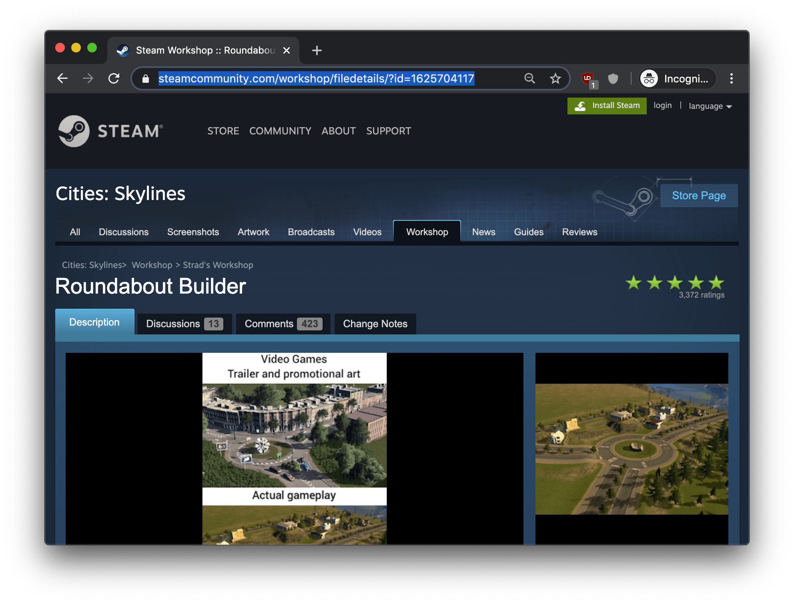
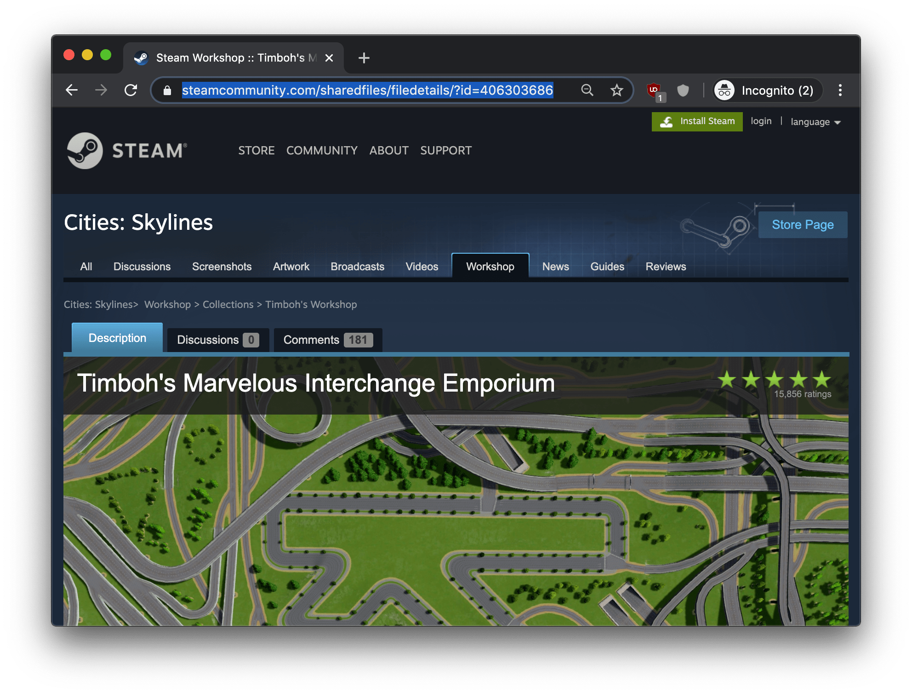
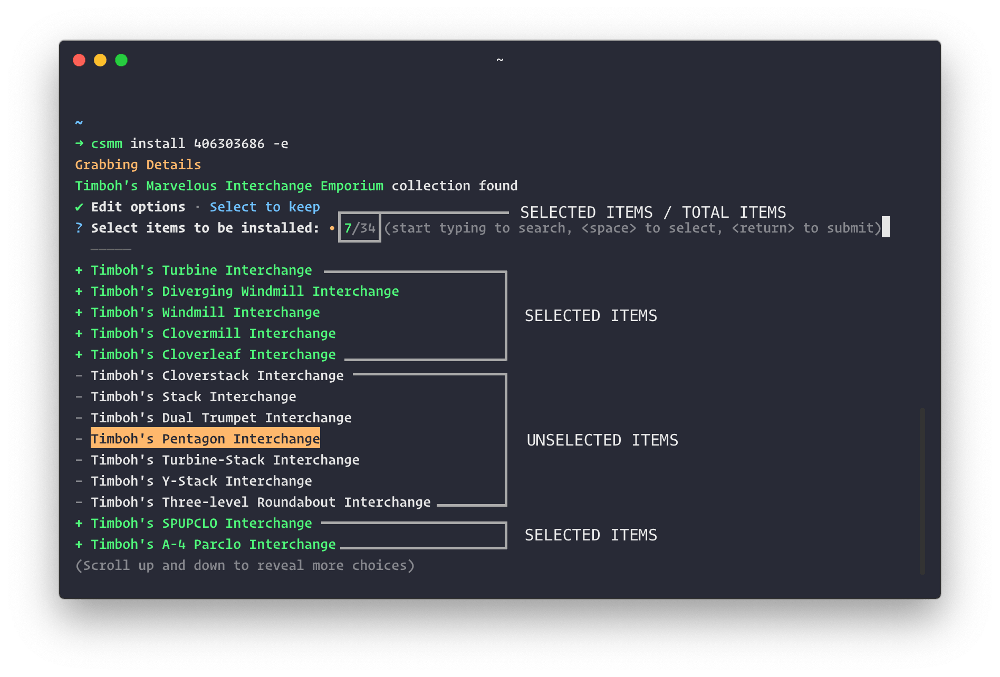

# Guide to use `csmm-cli`

This is a detailed guide on how to use `csmm-cli`, which covers everything from installation to its usage.

There are a few things you should keep in mind:

- `csmm-cli` is a **CLI** tool, which means it can be used through a `terminal` (on Mac and Linux) or `cmd` (on Windows).
- running a command, means enter the command into your `terminal` (or `cmd`) and then press `RETURN` (or `ENTER`) key on your keyboard.
- Windows users read [this](https://www.laptopmag.com/articles/how-to-windows-10-command-prompt-copy) for easy copy n paste in `cmd` command prompt.
- This guide uses **item** and **mod** interchangeably. Item or mod in this guide's context means individual installable content available on Cities: Skylines' steam workshop page which includes, Map, Mod, SaveGame, District Style, Map Theme, Scenario, Assets, Color Correction LUT, Cinematic Cameras.
- There will be some typos and grammatical mistakes.

## Table of Contents
* [Table of Contents](#table-of-contents)
* [Pre-installation](#pre-installation)
  * [Install Node.js](#install-nodejs)
  * [Backup Cities: Skylines mods and saves.](#backup-cities-skylines-mods-and-saves)
  * [Remove previously installed mods.](#remove-previously-installed-mods)
* [Installation](#installation)
* [Usage](#usage)
  * [Install](#install)
    * [Install single item](#install-single-item)
    * [Install collection](#install-collection)
    * [Change install method](#change-install-method)
  * [Uninstall](#uninstall)
    * [Uninstall a single item](#uninstall-a-single-item)
    * [Uninstall multiple items](#uninstall-multiple-items)
  * [Update](#update)
  * [List](#list)
* [Still Having Issues](#still-having-issues)

## Pre-installation

There are a couple of things you'll have to do before installing `csmm-cli` to make sure it works properly.

### Install Node.js

You'll need the latest version of Node.js to run `csmm-cli`. To setup Node.js on your computer follow

- [This guide](https://nodesource.com/blog/installing-nodejs-tutorial-windows) for Windows. (Step 0 is sufficient)
- [This guide](https://blog.teamtreehouse.com/install-node-js-npm-mac) for Mac
- [This guide](https://www.ostechnix.com/install-node-js-linux/) for Linux

If you have a fresh game install or don't have any saved games or mods installed manually, skip to [Installation](#installation).

### Backup Cities: Skylines mods and saves.

Backup your Cities: Skylines mods and saves, in case you don't like `csmm-cli`, or you start having issues with it, you can easily revert your game back to the state it was in before installing `csmm-cli`.

#### 1. Go to your Cities: Skylines user path

- On Windows: `%LOCALAPPDATA%\Colossal Order\Cities_Skylines`
- On Mac: `/Users/<username>/Library/Application Support/Colossal Order/Cities_Skylines`
- On Linux: `$XDG_DATA_HOME/Colossal Order/Cities_Skylines`

Note:

- The value of `%LOCALAPPDATA%` usually is `C:\Users\<username>\AppData\Local`
- `<username>` is the user name on your computer.
- These paths are usually hidden so use view hidden items.

#### 2. Copy the folder to a safe place

Copy the `Cities_Skylines` folder to somewhere safe. Since this might be needed in case you wish to revert back.

### Remove previously installed mods.

Make sure you have [backed up your mods and saves](#backup-your-cities-skylines-mods-and-saves) before moving forward with this part.

#### 1. Go to your Cities: Skylines user path (same as [here](#1-go-to-your-cities-skylines-user-path))

#### 2. Remove the folders named `ADDONS` and `MAPS`

Inside your Cities: Skylines user path, remove `ADDONS` and `MAPS` folder.

These folders usually contain mods you installed manually. These doesn't include maps or mods pre-installed in the game.

## Installation

To install `csmm-cli` open `cmd` or your preferred `terminal`.

Copy-paste the following command in your terminal window and press enter (or return)

```bash
npm install -g csmm-cli
```

This command installs the latest version of `csmm-cli` globally. The `-g` flag is necessary so that you can use the `csmm` commands from anywhere in your terminal and it will work as intended.

To ensure `csmm-cli` installed correctly run the following command in a new terminal (cmd) window.

```bash
csmm help
```

If successfully installed, this should output some text similar to this

```text
A mod manager for Cities: Skylines

VERSION
  csmm-cli/0.5.0 darwin-x64 node-v13.8.0

USAGE
  $ csmm [COMMAND]

COMMANDS
  config     View or Modify User Config
  help       display help for csmm
  install    Install a single mod or a collection along with their dependencies. Use id in steam
             URL as the SteamID.
  list       List all the installed mods
  uninstall  Uninstall an item
  update     Updates all of the items installed. Will also install missing dependencies (required
             items) if any.
```

If you don't see any such text, instead an error like

```cmd
csmm is not recognized as an internal or external command
```

or

```bash
command not found
```

shows up, this means the installation was unsuccessful and you need to try installing it again. Go back to start of the [installation step](#installation).

## Usage

Once you have got `csmm-cli` installed successfully we can get to the exciting part, using it.

When you run the CLI for the first time it will ask you a few configuration questions.

**Max Concurrent Tasks**: Maximum no. of simultaneous downloads or fetching. It accepts a value between 1 and 6. If your internet speed is slow use a lower value.

**Saves Directory**: Your Cities: Skylines [user path](#1-go-to-your-cities-skylines-user-path).

**Temporary Downloads Folder**: Folder to store temporary downloads.

If the pre-filled details are correct, press enter (or return) to submit. Otherwise you can fill in your own custom details.

**Note:** `Saves Directory` and `Temporary Downloads Folder` will only accept correct and existing folder paths.

So, open up your terminal and enter

```bash
csmm list
```

you can learn more about this command [here](#list), but it's not necessary right now. We used this command since it doesn't change anything, and will let you setup the configuration values mentioned above.

Once you are done with the configuration setup, `No mods installed yet` may show up. This is because we used the `csmm list` command which gets executed after the first time configuration setup.

If due to any reason you want to change the configuration values later on, you can use the config command.

```bash
csmm config
```

This will bring up the initial configuration setup again.

### Install

You can search n browse the [steam workshop page](https://steamcommunity.com/app/255710/workshop/) for whatever item or collection you wish to add to your game.

To install anything using `csmm-cli` you'll need the **id** of that item (or collection) which you can get from its steam workshop's url.

Steam workshop URL's are typically structured like:

```url
https://steamcommunity.com/workshop/filedetails/?id=XXXXXXXXXX?or_more_stuff...
```

Use the `XXXXXXXXXX` part after `id=` as the `<steamId>` mentioned in commands.

The `XXXXXXXXXX` part only consists of numeric characters.

#### Install single item

Assume we wish to install `Roundabout Builder` mod in our game.

1. Go to steam workshop page of `Roundabout Builder`

<p align="center">

</p>

2. Get the URL 
`https://steamcommunity.com/workshop/filedetails/?id=1625704117`

3. Grab the **id** part from the URL `1625704117`
4. Open Terminal (or cmd) and type

    ```bash
    csmm install 1625704117
    ```

    where `1625704117` is the id of `Roundabout Builder`.
5. Press enter or return and let `csmm-cli` install the mod to your game.

That's it. Once finished you should have the `Roundabout Builder` mod in your game. Make sure you enable the mod in in-game options.

#### Install collection

Installing a collection is exaclty the same procedure as installing a single item.

The install command

```bash
csmm install <steamId>
```

Will automatically detect if the given **id** belongs to an item or a collection.

But suppose you don't want to install the complete collection, and install only a part of the collection you can use the `-e` or `--edit` flag to edit the items of a collections before install.

For example, `Timboh's Marvelous Interchange Emporium` is a collection of 34 different road interchanges.

<p align="center">

</p>

To install the complete collection you can use the basic install command

```bash
csmm install 406303686
```

but if you wish to install part of the collection use the command with the edit flag

```bash
csmm install 406303686 -e
```

once you run the command with the `-e` flag from your terminal, it will ask you how would you like to edit the list

- Select to keep *(select items to install, unselected items will be ignored)*
- Select to ignore *(select items to ignore, unselected items will be installed)*

Use arrow keys to highlight the prefferred option and then press enter (return).

You'll be presented with a list of items to select from, here you can use `UP` / `DOWN` arrow key to move the selector and press `SPACE` to select and deselect the items, once you are satisfied with the selection press `ENTER` or `RETURN` key.

#### Something like this

<p align="center">

</p>

The yellow highlighted part is the cursor (selector), which can be used to navigate the list.

Even thought there are 34 items in the example, the list only shows about 20 of them at a time. Moving beyond the last element will reveal more items. The list is in a circular form and will circle back to the first item on the list. To define the start of the list there is a dim dashed mark `----` which can be seen in the screenshot at the top of the list.

The mark on the left of the item on the list, i.e. `+` or `-`, represents item to be installed or ignored.

```text
+ SAMPLE MOD NAME
```

will be installed

```text
- SAMPLE OTHER MOD NAME
```

will be ignored.

This `+`, `-`, scheme is followed no matter which options you chose from

- select to keep
- select to ignore

but the appearance of selected items is different in both of them. In `select to keep` the selected items turn green to show that they'll be installed. Whereas in `select to ignore` the selected items turn red to show that they won't be installed.

#### Change install method

`csmm-cli` uses steam workshop to download mods by default, these are usually up-to-date and have almost all of the mods available to install.

If you wish to change this default behaviour due to some reason, you can use SMODS for the source of the mods.

Just use the `-m` or `--method` flag with `SMODS` in the install command. Example:

```bash
csmm install 1625704117 -m SMODS
```

where `1625704117` is the id of `Roundabout Builder` taken as an example, replace this with mod id you wish to install.

**Note:** This is not a permanent change, you'll have to use `-m SMODS` everytime you wish to install using SMODS.

More about the -m flag:

The `-m` or `--method` flag allows you to specify the source from where to download the item. This flag can have either `SMODS` or `STEAM` as it's value. It's set to `STEAM` as default, therefore

```bash
csmm install 1625704117 -m STEAM
```

is exaclty same as

```bash
csmm install 1625704117
```

So, you don't have to put `-m STEAM` every time you install something.

Installing mods from `STEAM` or `SMODS` have no difference in their working and will not duplicate in case you install them using both methods. Install command always replaces the mod if previously installed.

#### Error logging in Install Command

Install command logs every step of the process of installing a mod. And shows any errors or warnings if encountered.

- `[✓]` represents success.
- `[!]` represents warning.
- `[x]` represents failure.

Items logged with warning symbol will be retried (currently indefinitely), since they are most probably caused due to some temporary issue.

Items logged with failure symbol will **not** be retried, since they cannot be recovered simply by retrying, and usually require some external change to solve the issue.

### Uninstall

You can uninstall mods using 2 ways:

- Uninstall a single item
- Uninstall multiple items

#### Uninstall a single item

*This is **not** the preferred way of uninstalling items, use [Uninstall multiple items](#uninstall-multiple-items) instead. (You can uninstall single item with it too)*

To uninstall a single item you'll require it's **id** (same id we installed it with).

Once you have the **id**, you have to put the command in your terminal and press enter.

```bash
csmm uninstall <id>
```

replace `<id>` with id of the mod you wish to uninstall.

This will remove the installed item with id `<id>`.

**Note:** You cannot uninstall complete collections using a collection's id in `<id>`. Uninstall command can only uninstall individual items and not complete collections.

#### Uninstall multiple items

To uninstall multiple items you can use the uninstall command (without any id)

```bash
csmm uninstall
```

Using this command in your terminal will present a list, this list shows all of the installed items. You can move through the list using `UP`/`DOWN` arrow keys. Select all the items you wish to uninstall using `SPACE` key. Once you have selected all of the items you wish to uninstall press `ENTER` or `RETURN`.

The list works very similar to how it works in [editing collection](#something-like-this). So, I won't be going into too much detail.

Once you press `ENTER` or `RETURN` all the selected items will be removed.

**Note:** The list shown also allows you to enter an item name, to quickly search the item. Just make sure before you press `ENTER` or `RETURN`, `backspace` or `delete` any search keyword you input. This may cause an error while uninstalling.

### Update

This command updates all of the installed items at once. This also installs any missing item which is required by some other installed item.

Example: The `Move It` mod requires `Prop Precision` and `Prop Snapping` mods to be installed, and the `Prop Snapping`  mod requires `Prop & Tree Anarchy` to be installed.

So if you don't have any of the `Prop Precision`, `Prop Spanning` and  `Prop & Tree Anarchy`, The `Move it` mod won't work properly.

So, in case you uninstalled a dependency (required item) of an installed mod by mistake or it was not installed due to some reason, the update command will ensure that every installed mod has all of its dependencies (required items) installed.

This is taken care of when you install a mod using the `install` command, i.e. when you install a mod like `Move it` all of it's dependencies `Prop Precision`, `Prop Spanning` and  `Prop & Tree Anarchy` are installed automatically, so you don't have to manually install each and every one of them.

To use the update command, open up your terminal and enter

```bash
csmm update
```

and that's it!

**Note:** This will take time proportional to the no. of items installed.

### List

This command lists all the installed mods, along with their ids in a table form.

To use the list command, open up your terminal and enter

```bash
csmm list
```

That's it, these are all the commands.

## Still Having Issues

If you are still having issues or found a bug you can create an issue on github [repo](https://github.com/Kumar-Saksham/CSMM-CLI) (read [this](https://help.github.com/en/github/managing-your-work-on-github/creating-an-issue) on how to do it), I'll try to solve it.

## Give ⭐️ to the project

If you liked the project and found it useful, consider giving the [repo](https://github.com/Kumar-Saksham/CSMM-CLI) a star.
